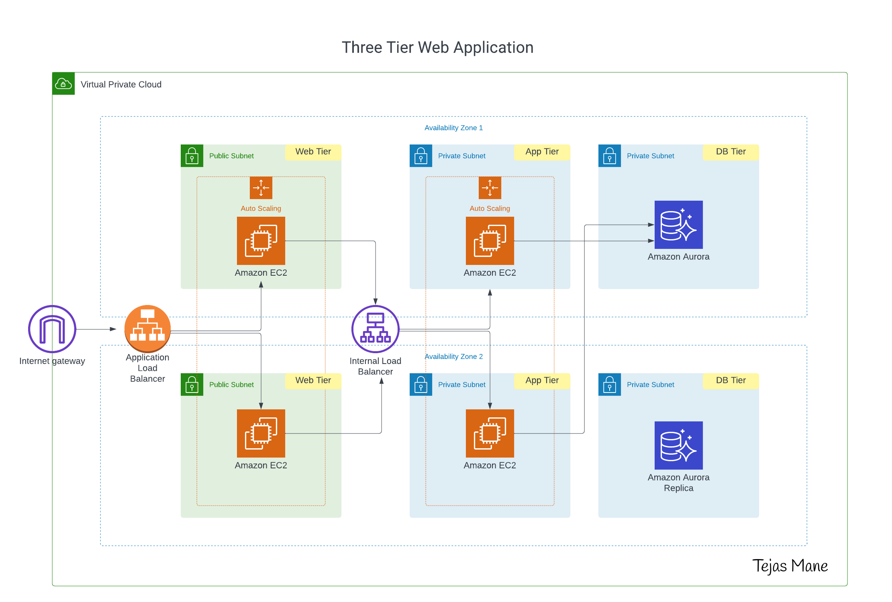

# Terraform 3-Stage Infrastructure Architecture

## Project Overview

This Terraform project provides a modular, multi-environment infrastructure setup with separate configurations for development, staging, and production environments.

## Project Architecture



## Project Structure
```
📂 terraform-3-stage-architecture/
│
├── 📂 environments/                 # Environment-specific configurations
│   ├── 📂 dev/                      # Environment-specific configurations
│   │   ├── main.tf
│   │   ├── variables.tf
│   │   ├── outputs.tf
│   │   └── terraform.tfvars
│   │
│   ├── 📂 staging/                 # Staging environment
│   │   ├── main.tf
│   │   ├── variables.tf
│   │   ├── outputs.tf
│   │   └── terraform.tfvars
│   │
│   └── 📂 prod/                    # Production environment
│       ├── main.tf
│       ├── variables.tf
│       ├── outputs.tf
│       └── terraform.tfvars
│
├── 📂 modules/                     # Reusable Terraform modules
│   ├── 📂 vpc/                     # Virtual Private Cloud module
│   │   ├── main.tf
│   │   ├── variables.tf
│   │   └── outputs.tf
│   │
│   ├── 📂 security/                # Security groups and network ACLs
│   │   ├── main.tf
│   │   ├── variables.tf
│   │   └── outputs.tf
│   │
│   ├── 📂 web_tier/                # Web server infrastructure
│   │   ├── main.tf
│   │   ├── variables.tf
│   │   └── outputs.tf
│   │
│   ├── 📂 app_tier/                # Application server infrastructure
│   │   ├── main.tf
│   │   ├── variables.tf
│   │   └── outputs.tf
│   │
│   └── 📂 db_tier/                 # Database infrastructure
│       ├── main.tf
│       ├── variables.tf
│       └── outputs.tf
│
└── 📄 backend.tf                    # Terraform backend configuration
```

## Environments

The project supports three environments:
- Development (`dev`)
- Staging (`staging`)
- Production (`prod`)

Each environment has its own:
- `main.tf`: Primary configuration file
- `variables.tf`: Input variables specific to the environment
- `outputs.tf`: Output values
- `terraform.tfvars`: Environment-specific variable values

## Modules

The infrastructure is broken down into modular components:

1. **VPC Module**: 
   - Manages network configuration
   - Creates subnets, route tables, and network interfaces

2. **Security Module**:
   - Defines security groups
   - Configures network ACLs
   - Manages security-related resources

3. **Web Tier Module**:
   - Provisions web server infrastructure
   - Configures load balancers
   - Sets up auto-scaling groups

4. **App Tier Module**:
   - Manages application server resources
   - Configures compute instances
   - Sets up application-specific networking

5. **DB Tier Module**:
   - Provisions database infrastructure
   - Configures database instances
   - Sets up database security and networking

## Prerequisites

- Terraform 1.0+
- Cloud Provider CLI (AWS/Azure/GCP)
- Appropriate cloud provider credentials


## Deployment Commands Cheat Sheet
## Dev Environment
```
terraform -chdir=environments/dev init
terraform -chdir=environments/dev plan
terraform -chdir=environments/dev apply
```
## Staging Environment
```
terraform -chdir=environments/staging init
terraform -chdir=environments/staging plan
terraform -chdir=environments/staging apply
```
## Production Environment
```
terraform -chdir=environments/prod init
terraform -chdir=environments/prod plan
terraform -chdir=environments/prod apply
```

## Deployment Workflow:

- Navigate to each environment's directory
- Run `terraform init` to initialize
- Run `terraform plan` to preview changes
- Run `terraform apply` to deploy

## Best Practices

- Always use separate state files for each environment
- Implement least-privilege access principles
- Use remote state storage
- Enable versioning and state locking
- Regularly update and rotate credentials

## Recommended Next Steps:

1. Implement more detailed security groups
2. Add more complex networking configurations
3. Integrate with CI/CD pipelines
4. Implement state management and remote backend

## Contributions

1. Fork the repository
2. Create a feature branch
3. Commit your changes
4. Push to the branch
5. Create a pull request

